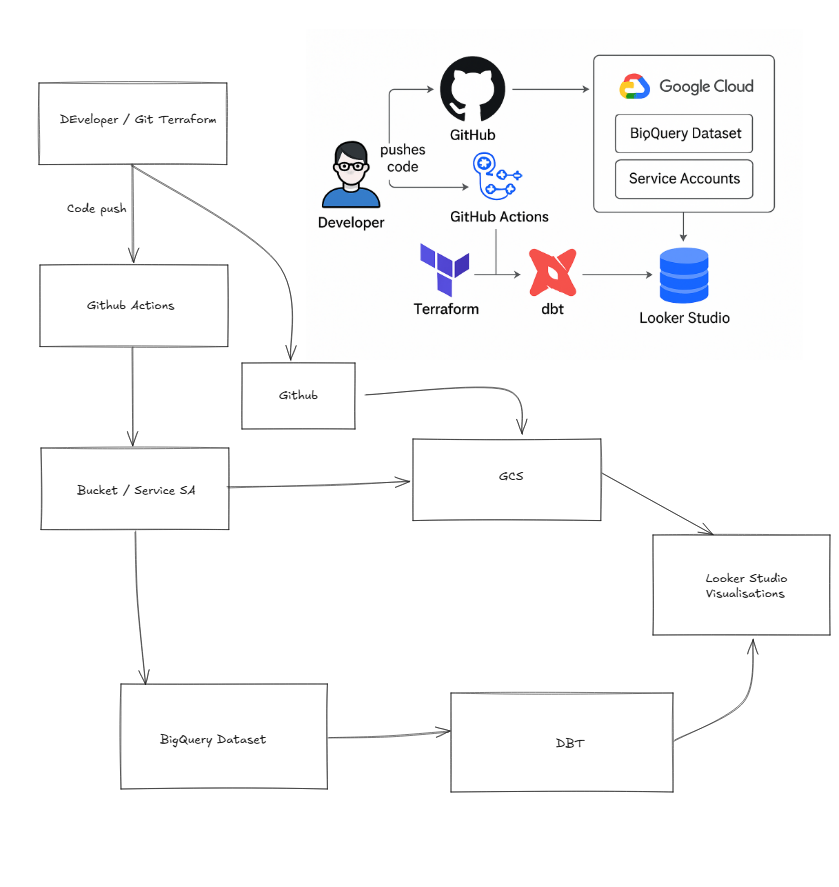

# Data Platform: DBT + GCP + Terraform + GitHub Actions

This project demonstrates a modern data pipeline built on Google Cloud Platform, using Infrastructure as Code with Terraform, dbt for data transformation, and complete automation (CI/CD) with GitHub Actions.

## 🚀 Architecture Overview

1. **Terraform**
   - Defines and deploys all infrastructure in Google Cloud Platform (BigQuery, Service Accounts, Buckets, etc).
   - Supports easy environment management (dev/prod) via variables and separate `.tfvars` files.

2. **DBT**
   - Stores SQL data transformation models, macros, and data quality tests.
   - Transformations are triggered as GitHub Actions jobs against the target environment.

3. **GitHub Actions**
   - Automates deployment: from infrastructure provisioning to dbt model runs.
   - Stores and manages secrets required for GCP authentication.

4. **Looker Studio** *(optional)*
   - Visualizes modeled and transformed data from BigQuery with dashboards.

## 📂 Directory Structure

/project-root
├── infra/
│ ├── main.tf
│ ├── bigquery.tf
│ ├── service-accounts.tf
│ ├── providers.tf
│ ├── variables.tf
│ ├── terraform.tfvars
│ └── terraform.prod.tfvars
├── dbt/
│ ├── dbt_project.yml
│ ├── profiles.yml
│ ├── models/
│ └── tests/
├── .github/
│ └── workflows/
│ └── deploy.yml
├── README.md
└── diagram-architecture.png

text

## 🔧 Deployment Guide

1. Configure your `.tfvars` files for both dev and prod environments. Set your GCP `project_id`.
2. Generate and upload relevant **service account keys** to GitHub secrets (e.g., `DEV_SA_KEY`, `PROD_SA_KEY`).
3. Trigger the workflow via GitHub Actions — your infrastructure and dbt models are provisioned and deployed automatically.
4. Data is transformed and loaded into BigQuery, ready for reporting in Looker Studio.

## 📋 Requirements

- Access to Google Cloud Platform with required permissions.
- Terraform (minimum version 1.5).
- Service account key with admin privileges for BigQuery and GCS.
- DBT (dbt-bigquery).
- GitHub Actions enabled for your repository.

## ✅ Main Commands

Deploy infrastructure locally:
cd infra
terraform init
terraform apply -var-file=terraform.tfvars

text

Run DBT locally:
cd dbt
dbt run --target dev

text

## 🧭 Architecture Diagram

---

*For a graphical version of the architecture, use the included diagram file or generate your own using the provided scheme.*